# PCB Crosstalk Analysis and Reduction

A reproducible simulation project: two parallel microstrip traces, one
aggressor, one victim. We model the coupling, sweep spacing / length /
plane distance, then improve the layout and quantify the difference.

**Result (simulated): peak victim crosstalk falls from 33.46 mV to
11.95 mV - a 64.3 % reduction.**

## Overview

When two high-speed traces run side by side over a reference plane,
the switching signal on one (aggressor) injects noise into the quiet
one (victim) through electric and magnetic field coupling. This project
works through that problem end to end: define the geometry, simulate
the victim response, find out which layout parameters matter most,
apply only the fixes the data supports, and re-run the identical
analysis to prove the improvement.

## The Problem

The baseline is intentionally uncomfortable: two 4-mil traces on 4-mil
edge-to-edge spacing (`S/H = 1.33`), 3 inches of continuous parallel
run, 3 mil above the plane, driven by a 1.2 V step with a 250 ps edge.

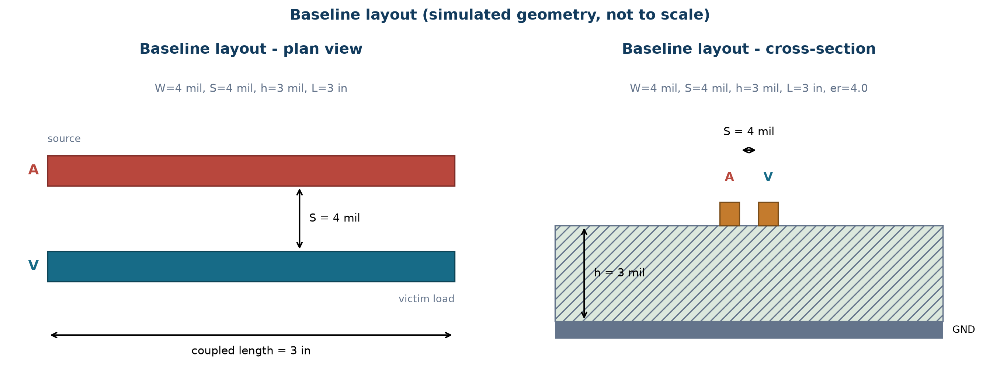

At 1W spacing the fringe fields from the aggressor terminate heavily
on the victim instead of the plane. The 3-inch adjacency then gives
that coupling 3 inches to accumulate into far-end noise.

## Simulation Method

Quasi-TEM coupled-microstrip model, all in `src/crosstalk_model.py`:

1. 2-D finite-difference solve of `div(eps*grad(phi)) = 0` for the
   Maxwell capacitance matrix, repeated in air for the inductance
   matrix (`L = mu0*eps0*inv(C0)`).
2. Even/odd-mode reduction; each mode propagates the 250 ps
   trapezoidal pulse down the coupled length.
3. Far-end victim voltage reconstructed as `0.5*(Ve - Vo)`.

Assumptions and limits are documented in [`docs/methodology.md`](docs/methodology.md);
sources in [`docs/references.md`](docs/references.md). The model reconstructs both victim ends: far-end (FEXT-type) voltage
via modal ABCD transfer, and near-end (NEXT) voltage via the loaded
modal input impedance - validated for polarity, timing, saturation,
and both zero limits before publication. No loss, no vias, no
guard-trace modelling: guard traces and via stitching are discussed
only qualitatively for exactly that reason.

## Baseline PCB Layout

| Parameter | Baseline |
|---|---|
| Trace width W | 4 mil |
| Edge spacing S | 4 mil (S/H = 1.33) |
| Dielectric height h | 3 mil |
| er | 4.0 |
| Coupled length | 3.0 in |
| Source | 1.2 V step, 250 ps (10-90 %) |
| Source / load | 40 ohm / 50 ohm per conductor |
| Modal Z (even/odd/geom.) | 66.4 / 54.4 / 60.1 ohm |

## Baseline Results

Peak far-end victim voltage: **33.46 mV** (2.8 % of the 1.2 V swing) -
a model-dependent simulated value for this geometry and stimulus, not
a prediction of measured hardware.

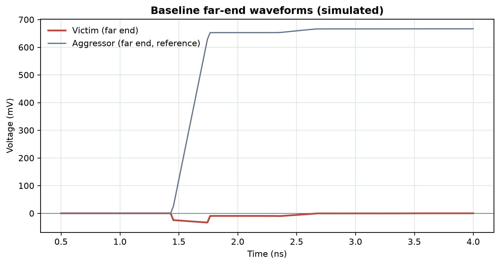

The pulse is negative-going FEXT-type: the modal delay skew
(151.2 vs 143.5 ps/in) separates even and odd arrivals, and the victim
sees their difference.

## Effect of Trace Spacing

Sweep at fixed W/h/length (`data/spacing_sweep.csv`):

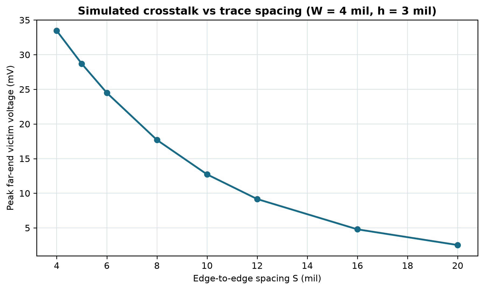

| S (mil) | 4 | 5 | 6 | 8 | 10 | 12 | 16 | 20 |
|---|---|---|---|---|---|---|---|---|
| Peak (mV) | 33.46 | 28.69 | 24.49 | 17.69 | 12.72 | 9.16 | 4.79 | 2.52 |

Wider spacing moves the victim out of the aggressor's fringe field, so
both mutual capacitance and mutual inductance fall. The drop is steep
at first and flattens - going from 4 to 8 mil removes nearly half the
noise; going from 16 to 20 mil buys far less. No fixed "3W = 70 %"
rule is claimed; the curve above is what this geometry produces.

## Effect of Parallel Length

Sweep at the baseline cross-section (`data/length_sweep.csv`):

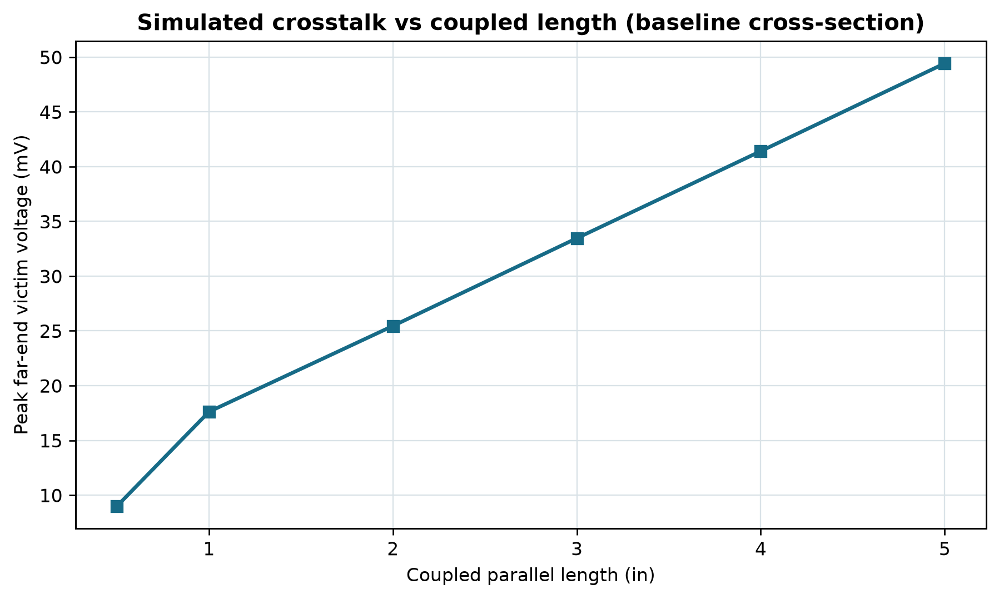

| Length (in) | 0.5 | 1.0 | 2.0 | 3.0 | 4.0 | 5.0 |
|---|---|---|---|---|---|---|
| Peak (mV) | 9.00 | 17.61 | 25.45 | 33.46 | 41.41 | 49.42 |

Longer adjacency accumulates more far-end noise in this model - the
modal skew acts over the full length. Note this is the model's honest
output for FEXT-type voltage; near-end NEXT would instead saturate
past a critical length, which is why length shortening is still worth
doing but should not be assumed linear in every topology.

## Effect of Layer Configuration

Sweep of plane distance at fixed W/S (`data/stackup_sweep.csv`):

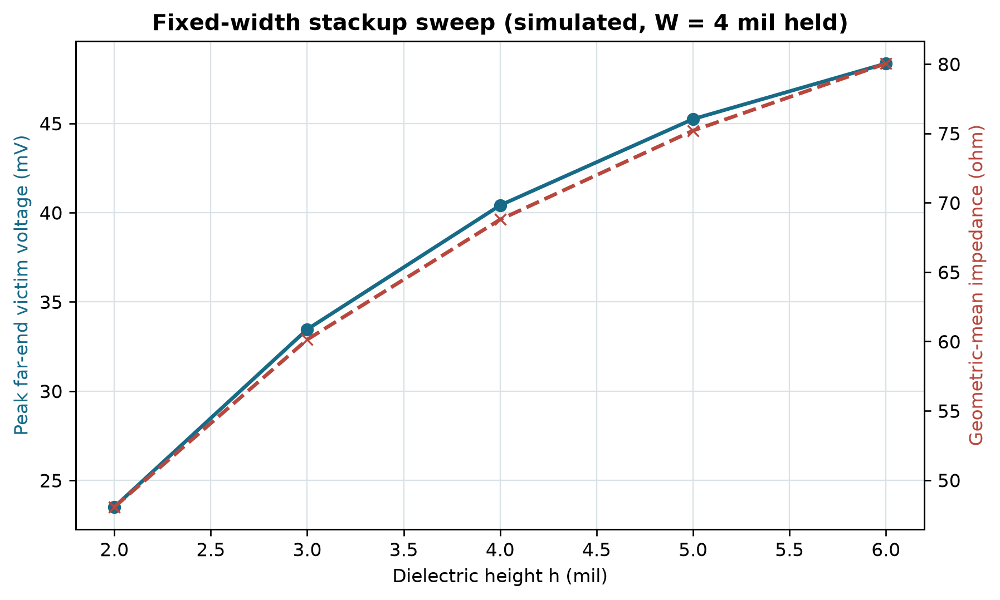

| h (mil) | 2 | 3 | 4 | 5 | 6 |
|---|---|---|---|---|---|
| Peak (mV) | 23.51 | 33.46 | 40.41 | 45.24 | 48.35 |
| Geom.-mean Z (ohm) | 48.1 | 60.1 | 68.8 | 75.2 | 80.0 |

A closer plane pulls field lines down and away from the neighbour, so
coupling falls in this fixed-width sweep. But the impedance falls with
it (48 vs 80 ohm across the sweep) - a thinner dielectric at the same
width is a different transmission line. And the monotonic fall does
not survive impedance retuning: the constant-impedance study below
shows FEXT cresting at h=4 mil, because retuning the width changes
velocity skew as well as coupling. No section of this project claims a
closer plane always reduces crosstalk. Any real stackup change must
retune the width, which is exactly what the improved layout does.

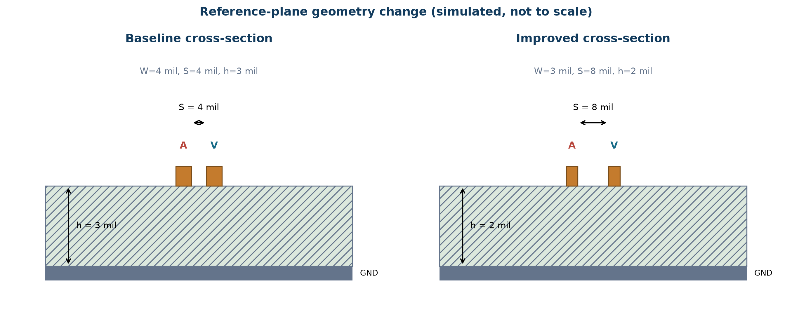

## Improved PCB Layout

Only changes the sweeps support - no guard traces, no via fences, no
length shortening (the 3-inch run is kept so the comparison is fair):

| Parameter | Baseline | Improved |
|---|---|---|
| Trace width W | 4 mil | 3 mil (retuned for h = 2 mil) |
| Edge spacing S | 4 mil | 8 mil |
| Dielectric height h | 3 mil | 2 mil |
| Coupled length | 3.0 in | 3.0 in (unchanged) |
| Modal Z (even/odd/geom.) | 66.4 / 54.4 / 60.1 ohm | 57.6 / 55.4 / 56.5 ohm |

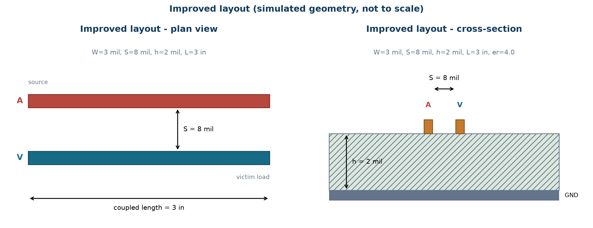

The narrower width at h = 2 mil brings the impedance back to 56.5 ohm,
close to the 60.1 ohm baseline - so the comparison is between two
routable 50-ohm-class geometries, not a matched line versus a
mismatched one.

Once spacing, reference-plane geometry, and routing constraints are
defined, the same signal-integrity considerations should be carried
into the physical [PCB layout]([JLCPCB PCB LAYOUT SERVICE URL] -
replace with the exact JLCPCB service URL provided by the client).

## Baseline vs Improved Results

Same stimulus, same method, same metrics (`data/improved_results.csv`):

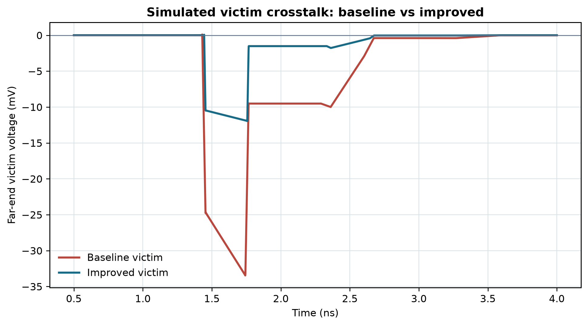

* Baseline peak: **33.46 mV**
* Improved peak: **11.95 mV**

Changing the baseline geometry from W=4 mil, S=4 mil, h=3 mil to the
combined optimized geometry W=3 mil, S=8 mil, h=2 mil reduced the
simulated peak far-end victim voltage from 33.46 mV to 11.95 mV, a
(33.46 - 11.95) / 33.46 x 100 % = 64.3 % reduction under this model
and stimulus. This is a **combined geometry optimization** - spacing,
plane distance, and width all changed - so it must not be read as
"spacing alone gives 64.3 %". The spacing-only contribution is
47.1 % (spacing sweep and controlled comparison below), and 64.3 %
is geometry/model specific, not a universal PCB rule.

The pulse shape is unchanged - same mechanism, less of it. Tighter
plane coupling plus doubled spacing cut the modal impedance split
(Ze-Zo falls from 12.0 to 2.2 ohm) and nearly equalised the modal
delays (7.8 ps/in skew down to 3.3 ps/in), which is precisely the
difference signal the victim responds to.

## Controlled Constant-Impedance Comparison

The v1 result mixes three changes, so a second study isolates them.
Each geometry below is tuned (trace width bisected, then refined over
the FDM staircase) to the baseline's own geometric-mean impedance,
60.1 ohm - chosen for comparability, not as a universal target.
Achieved Z: 60.1, 60.6, 58.9, 59.1 ohm. The residual mismatch comes
from conductor edges snapping to 0.25 mil FDM cells (e.g. W=4.09 snaps
to the same cells as W=4.00); a +/-1-snap sensitivity check moves peaks
by only a few percent, so the comparison stands. Same stimulus,
terminations, length, and dielectric throughout
(`data/controlled_comparison.csv`):

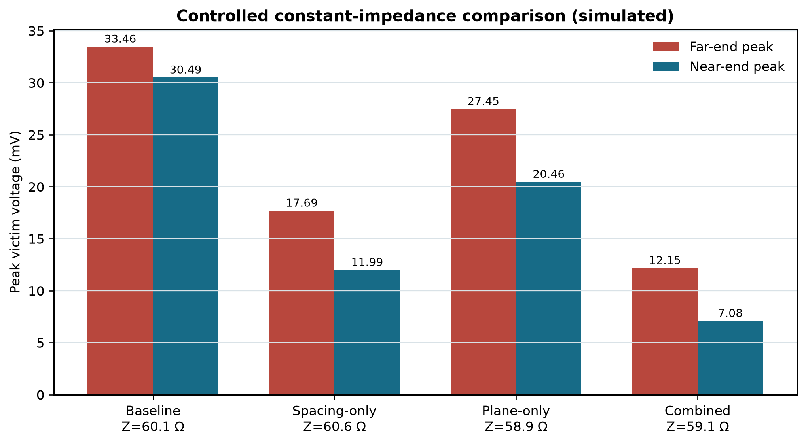

| Case | W (mil) | S (mil) | h (mil) | Ze (ohm) | Zo (ohm) | Zgm (ohm) | Far peak (mV) | Near peak (mV) | Far reduction |
|---|---|---|---|---|---|---|---|---|---|
| Baseline | 4.00 | 4 | 3 | 66.43 | 54.44 | 60.1 | 33.46 | 30.49 | - |
| Spacing only | 4.09 | 8 | 3 | 62.73 | 58.51 | 60.6 | 17.69 | 11.99 | 47.1 % |
| Plane only | 2.89 | 4 | 2 | 62.82 | 55.27 | 58.9 | 27.45 | 20.46 | 17.9 % |
| Combined | 2.89 | 8 | 2 | 60.28 | 57.94 | 59.1 | 12.15 | 7.08 | 63.7 % |

Spacing does most of the work (47.1 %), the closer plane adds
17.9 %, and the combined constant-Z design reaches 63.7 % - close to
the v1 64.3 %, as expected since the v1 improved width (3 mil) is
nearly the tuned width (2.89 mil). The two single-change effects sum
to 65.0 % against an actual 63.7 %; that near-additivity is
coincidence of this geometry, not a general rule - always simulate
the combination.

Three datasets, three uses: the spacing sweep for spacing statements,
this table for design optimization, 64.3 % only for the original
combined geometry. They are never mixed.

## Constant-Impedance Stackup Study

For each plane distance, W was retuned to hold ~60 ohm, answering "how
does coupling change when the trace moves relative to its plane at
fixed impedance?" - two variables change (h and W), so this is not
varying h alone (`data/stackup_constant_impedance.csv`):

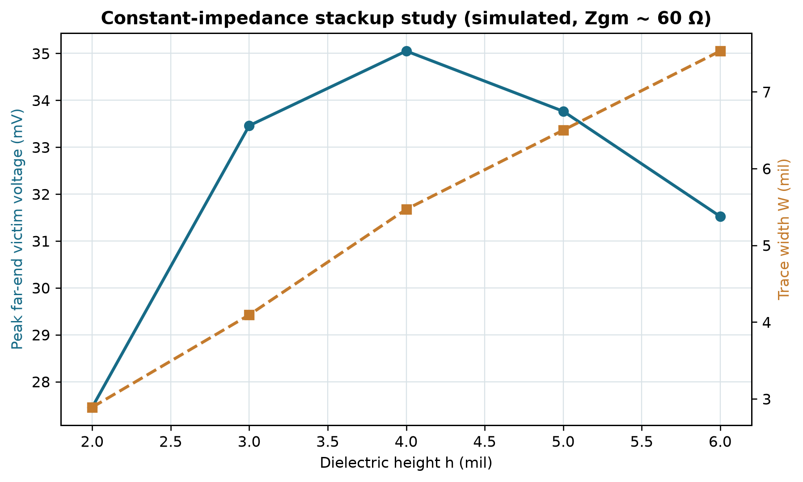

| h (mil) | W (mil) | S (mil) | Zgm (ohm) | Far peak (mV) | Near peak (mV) |
|---|---|---|---|---|---|
| 2 | 2.89 | 4 | 58.9 | 27.45 | 20.46 |
| 3 | 4.09 | 4 | 60.1 | 33.46 | 30.49 |
| 4 | 5.47 | 4 | 60.2 | 35.05 | 37.79 |
| 5 | 6.50 | 4 | 59.6 | 33.77 | 43.00 |
| 6 | 7.53 | 4 | 59.7 | 31.52 | 47.37 |

Near-end crosstalk grows monotonically as the (widening) trace couples
more strongly, but the far-end peak tops out at h=4 mil and then
falls. That is the model's honest output, and the mechanism is
visible in the modal data: the even/odd delay skew rises from 6.96 to
7.75 ps/in (h=2 to h=3) then falls to 5.35 ps/in at h=6, while the
impedance split keeps growing (7.6 to 19.7 ohm) and coupling magnitude
keeps growing (near-end proof). Far-end voltage is the product of
coupling strength and skew, so it tops out at h=4 where the two trends
cross. The old fixed-width sweep is kept separately and labelled as
such - it answers a different question.

## Near-End Crosstalk (NEXT)

The model also reconstructs the victim near-end voltage
(`0.5*(Ve_near - Vo_near)` per mode from the loaded input impedance,
reflections included), validated before publication:

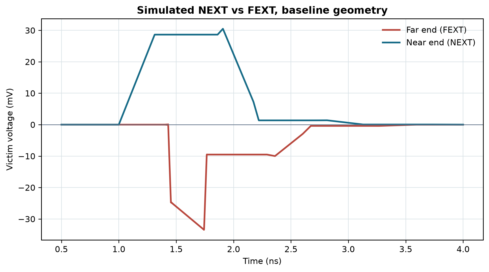

* Positive 30.49 mV plateau starting at source launch (same polarity
  as the aggressor edge), versus the -33.46 mV far-end dip.
* Plateau duration matches the round trip: 0.91 ns from the simulated
  waveform vs 0.88 ns computed (0.32 ns vs 0.29 ns at 1 in).
* Peak saturates with length: 28.37, 30.49, 31.73 mV at 1, 3, 5 in -
  textbook long-line NEXT behaviour, while FEXT keeps accumulating.
* Zero coupled length gives exactly 0.000 mV at both ends; S=40 mil
  leaves 0.94 mV far / 0.50 mV near (2.8 % of baseline), scaling with
  length as genuine weak coupling, not a noise floor.

## PCB Design Lessons

1. **Spacing is the cheapest decibel.** Doubling S from 4 to 8 mil
   roughly halves the noise in this geometry.
2. **Bring the plane closer, then retune the width.** A thin
   dielectric confines fields but drops impedance - always re-check Z.
3. **Shorten adjacency where you can**, but expect FEXT-type peaks to
   scale with length rather than vanish; combine with spacing.
4. **Rules of thumb are starting points.** 3W spacing has no fixed
   percentage attached - simulate your own stackup.
5. **Simulated numbers are geometry-specific.** These millivolts apply
   to this cross-section and stimulus, not to all PCBs.

## Reproduce This Project

Requires Python 3.10+ with `numpy`, `scipy`, `matplotlib`:

```bash
pip install -r requirements.txt
python src/simulate_crosstalk.py   # v1 baseline + combined -> data/
python src/sweep_spacing.py        # spacing sweep -> data/
python src/sweep_geometry.py       # length + fixed-width stackup -> data/
python src/controlled_comparison.py # constant-Z A/B -> data/
python src/sweep_stackup_constZ.py  # constant-Z stackup -> data/
python src/validate_model.py       # convergence + benchmarks -> data/
python src/robust_check.py         # sensitivity/skew/domain spot-checks
python src/plot_results.py         # v1 figures from the CSVs
python src/plot_controlled.py      # controlled-study figures
python src/verify_numbers.py       # JSON/CSV/prose agreement gate (exit 0)
```

All simulation scripts were run successfully in this order;
`plot_results.py` / `plot_controlled.py` read only the saved CSVs
(plus one live model evaluation for the NEXT/FEXT overlay, at default
settings), so figures always match the data. The v1 subset
(simulate + sweeps + plots) takes a few minutes on a laptop; the full
pipeline including width tuning and convergence studies takes on the
order of an hour, dominated by the 2-D field solves.

## Limitations

First-order model: no dielectric/conductor loss, no solder mask, no
glass weave, no vias/connectors/package coupling, single-ended
microstrip only, far-end voltage only. Do not read the millivolt
values as universal design rules - rerun the scripts for your own
stackup.

## References

See [`docs/references.md`](docs/references.md): TI SCAA082A, AN-337,
SPRU889, SNLA426; Simonovich (Signal Integrity Journal) on coupled
lines; Bogatin & Simonovich on guard traces; Siemens EDA crosstalk
overview; Bogatin *Signal and Power Integrity - Simplified*.

---

*Analysis project prepared for JLCPCB - all data simulated as labelled.*


